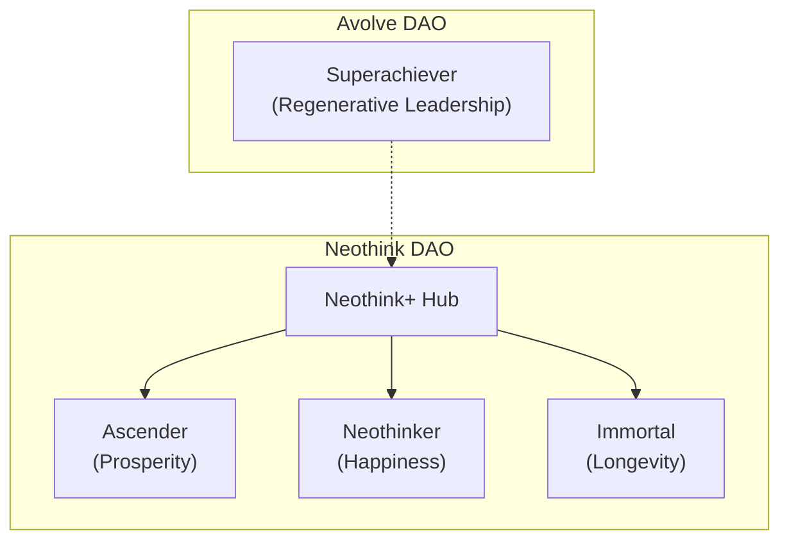

# Joshua Seymour — Architecting Positive-Sum Network States

> **Neothink DAO: Established communities with thousands of members. New platforms are in testing and will soon launch as major upgrades—empowering you to unlock even more of your potential. Join us as we evolve toward true DAOs/coops, where your participation shapes the future. Leveraging Optimism for scalable, transparent, and secure coordination.**

> **Avolve DAO: A brand new initiative for regen-minded geniuses, entrepreneurs, and builders. Be a founding member and co-create a regenerative, positive-sum society from day one. Pioneering with emerging web3/blockchain technology, including Psibase, to push the boundaries of decentralized communities.**

> Unlock prosperity, happiness, and longevity—join a movement where your genius shapes the future.

> **Join the journey: [Neothink DAO](https://github.com/neothink-dao/neothink.io) for Ascenders, Neothinkers, and Immortals; [Avolve DAO](https://github.com/avolve-dao/avolve.io) for Superachievers.**

**Are you seeking greater prosperity, happiness, or longevity? Ready to build, learn, and thrive with others like you?**

Welcome! I’m Joshua Seymour.

I started these projects to empower individuals and communities to flourish—combining my passion for innovation, decentralized systems, and human potential. I architect and steward digital-physical communities designed to unlock human flourishing—through positive-sum, regenerative, and network state principles. My focus is on building and evolving [Neothink DAO](https://github.com/neothink-dao/neothink.io) (intrapreneurship, established communities) and [Avolve DAO](https://github.com/avolve-dao/avolve.io) (entrepreneurship, new and launching), each with a clear mission, founder, and path to progressive decentralization.

I thrive in global, collaborative environments—online and offline—and am always open to connecting, co-creating, and relocating for the right opportunities and teams.

**Let's connect! Reach out via [GitHub Discussions](https://github.com/joshuaseymour/joshuaseymour/discussions), open an issue, or use the contact form on [joshuaseymour.com](https://www.joshuaseymour.com) to explore how we can collaborate and create positive impact together.**

---

## Avolve: The Supercivilization Journey

Avolve is designed to help individuals, collectives, and the entire ecosystem transform from Degen (zero-sum) to Regen (positive-sum), unlocking greater health, wealth, and peace for all. The journey is structured as:

- **One Focus:** Supercivilization
- **Two Views:** Superachiever (individual) & Superachievers (collective)
- **Three Keys:** Personal Success Puzzle, Business Success Puzzle, Supermind Superpowers
- **Four Cores:** Superpuzzle Developments, Superhuman Enhancements, Supersociety Advancements, Supergenius Breakthroughs

```mermaid
flowchart TD
  GEN[GEN<br/>Supercivilization<br/>(One Focus)]
  GEN --> SAP[SAP<br/>Superachiever<br/>(Two Views: Individual)]
  GEN --> SCQ[SCQ<br/>Superachievers<br/>(Two Views: Collective)]

  SAP --> PSP[PSP<br/>Personal Success Puzzle<br/>(Key 1)]
  SAP --> BSP[BSP<br/>Business Success Puzzle<br/>(Key 2)]
  SAP --> SMS[SMS<br/>Supermind Superpowers<br/>(Key 3)]

  SCQ --> SPD[SPD<br/>Superpuzzle Developments<br/>(Core 1)]
  SCQ --> SHE[SHE<br/>Superhuman Enhancements<br/>(Core 2)]
  SCQ --> SSA[SSA<br/>Supersociety Advancements<br/>(Core 3)]
  SCQ --> SGB[SGB<br/>Supergenius Breakthroughs<br/>(Core 4)]
```

**Legend:**  
- *GEN*: Genius ID, GEN coin/token, Genie AI  
- *SAP*: Superachiever Playbook, Personal/Business Success  
- *SCQ*: Supercivilization Quests, collective transformation  
- *PSP/BSP/SMS*: Three Keys for individual growth  
- *SPD/SHE/SSA/SGB*: Four Cores for collective and ecosystem advancement

---

## Quick Start:**
- [Become an Ascender, Neothinker, or Immortal →](https://github.com/neothink-dao/neothink.io)
- [Join the Superachievers →](https://github.com/avolve-dao/avolve.io)

---



---

## What You’ll Experience & Why It Matters

### **Neothink DAO: Unlock Your Next Level**
- **Neothink DAO:** Already home to thousands of members—now evolving. The new platforms are in testing and will soon launch as major upgrades for all. Help us transition to a true DAO/coop and shape the future of your community.
- **Tech:** Neothink DAO will leverage established web3/blockchain infrastructure, specifically Optimism, for scalable, transparent, and secure coordination.
- **Ascenders:** For value creators seeking greater prosperity. Build your business, grow your wealth, and join a supportive community of achievers. [Start as an Ascender →](https://github.com/neothink-dao/neothink.io)
- **Neothinkers:** For integrated thinkers seeking greater happiness. Unlock genius-level thinking, access transformative knowledge, and connect with visionary peers. [Start as a Neothinker →](https://github.com/neothink-dao/neothink.io)
- **Immortals:** For self-leaders seeking greater longevity. Pursue optimal health, longevity, and join the movement to make death optional. [Start as an Immortal →](https://github.com/neothink-dao/neothink.io)
- **Neothink+ Hub:** Synergize your journey—earn rewards, access cross-app benefits, and prosper happily forever.

### **Avolve DAO: Superachievers Wanted**
- **Avolve DAO:** A new initiative for regen-minded, genius-level entrepreneurs and builders. Be a founding member and co-create the Supercivilization from the ground up.
- **Tech:** Avolve DAO will pioneer with emerging web3/blockchain technology, testing Psibase and other next-gen protocols to push the boundaries of regenerative, decentralized communities.
- **For Superachievers:** If you’re driven to excel, build, and regenerate—Avolve DAO is your launchpad. Join a collective of entrepreneurs, builders, and innovators co-creating the Supercivilization. [Join Avolve DAO →](https://github.com/avolve-dao/avolve.io)
- **For Emerging Leaders:** Step up, collaborate, and shape the future. Avolve is where your ambition meets a positive-sum, regenerative mission.

---

## Technology & Roadmap

- **Neothink DAO:**
  - Built on established web3 infrastructure (Optimism L2)
  - Focused on scalable, transparent, and secure member coordination
  - Progressive rollout to existing communities

- **Avolve DAO:**
  - Built as a testbed for emerging protocols (Psibase, etc.)
  - Focused on innovation, regeneration, and next-gen DAO/coop models
  - Open call for founding contributors and regen-minded builders

---

## Why Join?

- **User:** Become a Subscriber, Participant, or Contributor—enjoy access, community, and rewards in our apps and DAOs.
- **Admin:** Become a Venture Builder (building), Venture Partner (funding), or Venture Associate (helping)—shape new societies as a leader, backer, or supporter.

---

## At a Glance: The Ecosystem

| Project         | Focus                | For Whom?                      | Unique Value                              |
|-----------------|---------------------|--------------------------------|-------------------------------------------|
| [Neothink DAO](https://github.com/neothink-dao/neothink.io)    | Prosperity, Happiness, Longevity | Ascenders, Neothinkers, Immortals    | Progressive journeys, unified rewards     |
| [Avolve DAO](https://github.com/avolve-dao/avolve.io)      | Regen Supercivilization         | Superachievers, Emerging Leaders | Degen→Regen journey, collective quests    |

---

## Your Journey

1. Choose your path: Ascender, Neothinker, Immortal, or Superachiever.
2. Become a User (Subscriber, Participant, Contributor) or Admin (Venture Builder, Partner, Associate).
3. Join the DAO(s) and unlock your personal and collective transformation.
4. Earn tokens, XP, and rewards as you progress.
5. Co-create a network state—digital, physical, and regenerative.

---

## Roadmap: The Path to a Network State

- **Startup Society:** Launch and grow values-driven digital communities (Neothink DAO, Avolve DAO)
- **Network Union:** Unite members for collective action, shared governance, and positive-sum collaboration
- **Network Archipelago:** Expand into crowdfunded physical presence, events, and projects
- **Network State:** Achieve on-chain governance, real-world legitimacy, and diplomatic recognition as a sovereign, regenerative society

*Each milestone builds on the previous—your participation helps us move from vision to reality.*

---

## Our Story & Why Now?

We’re at a tipping point: the world needs new models for prosperity, happiness, and longevity. By combining the best of digital and physical communities, we’re building network states that empower individuals and collectives to create lasting, positive-sum change. If you’re ready to help shape the future, you’re in the right place.

---

## Start Here

- [Neothink DAO (Ascenders, Neothinkers, Immortals)](https://github.com/neothink-dao/neothink.io)
- [Avolve DAO (Superachievers)](https://github.com/avolve-dao/avolve.io)
- [Connect with Joshua Seymour](https://www.joshuaseymour.com)
- **Attend a Weekly Call:** Check each project’s repo for event details

---

## Why Support Me & These Projects?

- **Proven Vision & Dedication:** I have a track record of architecting and stewarding ambitious, values-driven communities. My commitment is to positive-sum, regenerative impact—not hype or speculation.
- **Founder-Led, Mission-Driven:** Both Neothink DAO and Avolve DAO have clear founders, transparent governance, and a principled roadmap to progressive decentralization.
- **Real-World Value:** These projects are designed to unlock prosperity, happiness, and longevity for real people—not just digital avatars. Every feature, event, and reward is crafted for genuine transformation.
- **Community as Platform:** Each site/app is a living, breathing social platform—where your participation shapes the culture, tools, and future of the ecosystem.
- **Your Support Multiplies Impact:** By supporting me and these projects, you accelerate the creation of new models for flourishing—empowering yourself and others to thrive in a rapidly changing world.
- **Aligned Incentives:** As a supporter, you benefit from transparent rewards, shared ownership, and a direct stake in the success of the network states we’re building.

> **If you believe in a future of prosperity, happiness, and longevity for all—your support is the catalyst that will make it real.**

---

## Frequently Asked Questions & Common Objections

**What is a “network state” and why should I care?**  
A network state is a digitally native community with a shared vision, real-world impact, and a path to self-governance. By joining early, you help shape the rules, culture, and benefits of a new society—while earning rewards and building meaningful relationships.

**Is this just another crypto project or online community?**  
No. While we intend to use web3 and blockchain for transparency and coordination later this year, our current focus is on real transformation: personal, collective, and ecosystem-wide. Our DAOs are built around positive-sum values, not speculation.

**Do I need to be a developer or blockchain expert to join?**  
Not at all! Anyone can join as a Subscriber, Participant, or Contributor. We welcome learners, builders, creators, and supporters from all backgrounds.

**How do I actually get started?**  
Pick a path (Neothink DAO or Avolve DAO), join as a User or Admin, and follow the onboarding steps. Each site/app is its own social and communication platform—so you’ll connect, share, and participate directly within the ecosystem.

**What if I just want to observe or learn before committing?**  
That’s fine! You can explore the public areas of each platform, read resources, and observe community activity before diving deeper.

**What’s the business model? How are projects funded?**  
We use a mix of subscriptions, token rewards, and venture partnerships. Admins (builders, partners, associates) help shape and fund new projects, while Users enjoy access and community benefits.

**How do you avoid the pitfalls of other DAOs or online movements?**  
We focus on real-world value, progressive decentralization, and a clear governance roadmap. Our founders are public, our vision is long-term, and we prioritize collaboration over hype.

**How can I trust this isn’t a scam or rug pull?**  
Transparency is key: our founders are public, our code and governance are open, and our incentives are aligned for long-term growth and positive impact.

**What if I have more questions?**  
Reach out directly, join a call, or connect with us within the platforms. We’re here to help!

---

> **Curious?**  
> Explore a platform. Join a call. Reach out directly.  
> The next chapter of networked transformation is just beginning.
