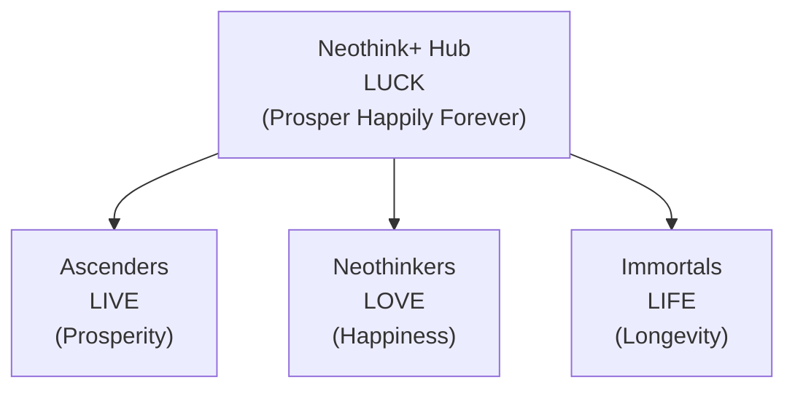
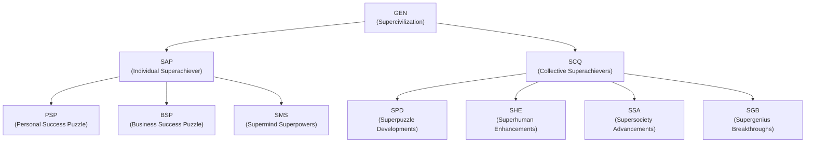

# Joshua Seymour — Architecting Positive-Sum Network States

Welcome! I’m Joshua Seymour.

I build and steward four parallel startup societies—each designed to evolve into a full-fledged network state. My work is about architecting digital-physical communities that unlock human flourishing, using the latest in AI, web3, and decentralized protocols (including Optimism and Psibase).

I thrive in global, collaborative environments—online and offline—and am always open to connecting, co-creating, and relocating for the right opportunities and teams.

- **Technical curiosity:** I experiment with new models for coordination, learning, and value creation.
- **Philosophy:** I believe in global meritocracy, open web values, and the power of decentralized, internet-native communities.
- **Vision:** I am passionate about the “startup society” and network state journey, especially as it relates to solarpunk, regenerative futures.

Neothink DAO and Avolve DAO have already attracted early users and contributors. I’m always interested in new collaborators, partners, and aligned communities.

---

## Governance & Network State Vision

Both Neothink DAO and Avolve DAO are parallel startup societies, intentionally structured to mature into true network states—each with a clear founder, a strong sense of mission, and a path toward progressive decentralization and self-governance.

> “A network state is a social network with a moral innovation, a sense of national consciousness, a recognized founder, a capacity for collective action, an in-person level of civility, an integrated cryptocurrency, a consensual government limited by a social smart contract, an archipelago of crowdfunded physical territories, a virtual capital, and an on-chain census that proves a large enough population, income, and real estate footprint to attain a measure of diplomatic recognition.”

**Founders & Governance Structure:**
- **Neothink DAO:**  
  - The recognized founder of Ascenders, Neothinkers, and Immortals (and their related values) is Mark Hamilton, his family, and their core supporters.
  - The Neothink+ monorepo is owned and controlled by Neothink DAO, with Mark Hamilton (along with his family and team) as the benevolent dictator and philosopher king, stewarding the project until these parallel societies mature to fully govern themselves.

- **Avolve DAO:**  
  - The recognized founder of Avolve and its super-projects is Joshua Seymour.
  - The Avolve repo is owned and controlled by Avolve DAO, with Joshua Seymour (along with his family and team) as the benevolent dictator and philosopher king, guiding the project until it matures into full self-governance.

**Stewardship Philosophy:**  
Both DAOs are committed to progressive decentralization. The “benevolent dictator” model is a temporary measure to ensure strong leadership, clear vision, and principled growth—until the communities are ready for fully decentralized, self-sustaining governance.

**Network State Trajectory:**  
Each society is intentionally structured to:
- Start as a focused, values-driven startup society
- Grow into a network union (digital community with collective action)
- Expand into a network archipelago (crowdfunded physical presence)
- Ultimately achieve the scale, legitimacy, and diplomatic recognition of a true network state

---

## 🚀 Neothink DAO (Intrapreneurship)

A monorepo of four synergistic Next.js apps—each with its own token and unique journey, all sharing a unified Supabase backend.

**Blockchain:** Neothink DAO intends to use [Optimism](https://optimism.io/) for its 4 sites/apps/tokens/DAOs/projects.

| App           | Token | Theme        | Outcome                        |
|---------------|-------|--------------|--------------------------------|
| Ascenders     | LIVE  | Prosperity   | Build wealth & business mastery|
| Neothinkers   | LOVE  | Happiness    | Unlock genius & fulfillment    |
| Immortals     | LIFE  | Longevity    | Maximize health & lifespan     |
| Neothink+ Hub | LUCK  | Prosper Happily Forever | Synergy, cross-app rewards |

- **One Purpose:** Prosper Happily Forever  
- **Two Missions:** Individual & Collective  
- **Three Visions:** Prosperity, Happiness, Longevity  
- **Four Goals:** Ascender, Neothinker, Immortal, Superachiever

Each app is a progressive journey—beginner to advanced—where every action earns tokens, XP, badges, and unlocks new features.  
**Neothink+ Hub** unifies your experience, enabling synergy and rewards across all apps.

---

## 🌌 Avolve DAO (Entrepreneurship)

Avolve DAO is a standalone but interoperable platform focused on building the Supercivilization—a positive-sum, regenerative future.

**Blockchain:** Avolve DAO intends to use [Psibase](https://docs.psibase.io/) for its DAO and ecosystem.

| Layer/Focus           | Token | Purpose/Outcome                                      |
|-----------------------|-------|-----------------------------------------------------|
| Supercivilization     | GEN   | The main token powering the ecosystem                |
| Individual View       | SAP   | Superachiever: Personal transformation              |
| Collective View       | SCQ   | Superachievers: Collective co-creation              |
| Personal Success      | PSP   | Personal Success Puzzle                             |
| Business Success      | BSP   | Business Success Puzzle                             |
| Supermind Superpowers | SMS   | Unlock advanced problem-solving & action            |
| Superpuzzle Devs      | SPD   | Drive grand collective progress                     |
| Superhuman Enhance.   | SHE   | Support superhuman growth for all ages              |
| Supersociety Adv.     | SSA   | Advance companies, communities, and countries       |
| Supergenius Breakth.  | SGB   | Fuel innovation and ecosystem breakthroughs         |

- **One Focus:** Supercivilization (GEN)  
- **Two Views:** Individual Superachiever (SAP) & Collective Superachievers (SCQ)  
- **Three Keys:** Personal Success Puzzle (PSP), Business Success Puzzle (BSP), Supermind Superpowers (SMS)  
- **Four Cores:** Superpuzzle Developments (SPD), Superhuman Enhancements (SHE), Supersociety Advancements (SSA), Supergenius Breakthroughs (SGB)

---

## 🗺️ Ecosystem Visuals

### Neothink DAO: LUCK Unifies LIVE, LOVE, LIFE

### Avolve DAO: GEN Unfolds the Supercivilization

---

## 🌐 Network State Vision

Neothink DAO and Avolve DAO are proto-network states: digitally native, values-driven communities with the potential to evolve into fully sovereign, self-governing entities.  
Each archetype and platform is a building block for a new kind of society—wealthiest, happiest, healthiest, and most regenerative—powered by flawless positive-sum game theory.

---

## 🏆 My Roles

- **Intrapreneur (Neothink DAO):**  
  - Architecting and scaling platforms within an established vision.
  - Driving innovation, onboarding, and internal growth.
- **Entrepreneur (Avolve DAO):**  
  - Founding, leading, and evolving a new regenerative ecosystem.
  - Building from scratch, driving adoption, and shaping governance.

---

## 📈 Roadmap & Next Steps

- Launching four interconnected apps with unified onboarding and gamified progression
- Immediate, actionable quests and rewards for new users
- Weekly live events for each archetype (Ascenders, Neothinkers, Immortals, Superachievers)
- DAO-governed treasury and positive-sum tokenomics
- Expanding the Supercivilization vision through Avolve DAO

---

## 🤝 Get Involved

- [Learn more about Neothink DAO](https://github.com/neothink-dao/neothink.io)
- [Discover Avolve DAO](https://github.com/avolve-dao/avolve)
- [Connect with Joshua Seymour](https://www.joshuaseymour.com)

---

> **Curious?**  
> Explore a platform. Join a call. Reach out directly.  
> The next chapter of networked transformation is just beginning.
