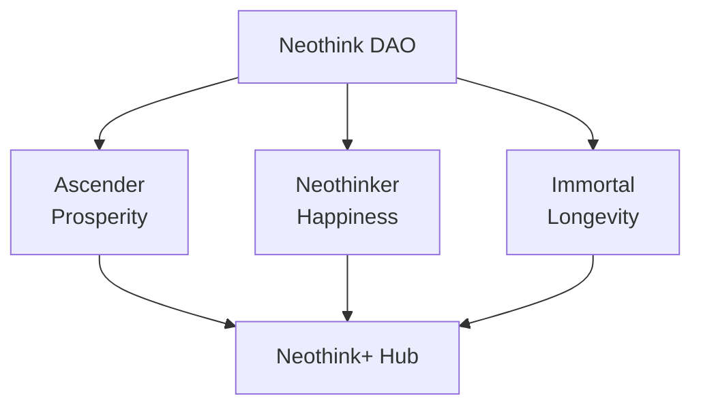
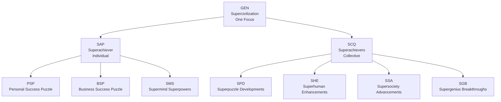

# Joshua Seymour — Architecting Positive-Sum Network States

> **Unlock Your Potential:** Join Neothink DAO and Avolve DAO—two pioneering, founder-led communities for those ready to shape the future of prosperity, happiness, and longevity.

> **Neothink DAO:** For Ascenders, Neothinkers, and Immortals already committed to growth. Join thousands evolving toward true DAOs/coops where your participation drives real-world transformation. Built on [Optimism](https://www.optimism.io/) for scalable, transparent, and secure coordination.

> **Avolve DAO:** For Superachievers—regen-minded founders, entrepreneurs, and builders ready to co-create a regenerative, positive-sum society from day one. Pioneering with [Psibase](https://psibase.io/) and next-gen web3 technology.

> **Already on your journey?** These DAOs are for those who want to go further, faster, and forever—accelerating impact, deepening purpose, and collaborating with peers who value real results over hype.

> **Connect and Collaborate:** Reach out via [GitHub Discussions](https://github.com/joshuaseymour/joshuaseymour/discussions), open an issue, use the contact form, or the social links and contact options on [joshuaseymour.com](https://www.joshuaseymour.com) to explore how we can create lasting impact together.

---

## Table of Contents

- [Neothink DAO: Ecosystem Overview](#neothink-dao-ecosystem-overview)
- [Avolve: The Supercivilization Journey](#avolve-the-supercivilization-journey)
- [What You’ll Experience & Why It Matters](#what-youll-experience--why-it-matters)
- [Technology & Roadmap](#technology--roadmap)
- [Why Join?](#why-join)
- [At a Glance: The Ecosystem](#at-a-glance-the-ecosystem)
- [Your Journey](#your-journey)
- [Our Story & Why Now?](#our-story--why-now)
- [Start Here](#start-here)
- [Why Support Me & These Projects?](#why-support-me--these-projects)
- [Frequently Asked Questions & Common Objections](#frequently-asked-questions--common-objections)
- [Contact](#contact)

---

## Neothink DAO: Ecosystem Overview

Neothink DAO unites **Ascenders**, **Neothinkers**, and **Immortals**—builders, thinkers, and leaders already on the path—into a synergistic ecosystem for next-level prosperity, happiness, and longevity.

---

## Avolve: The Supercivilization Journey

Avolve DAO is for **Superachievers**—regen-minded founders, entrepreneurs, and builders who want to co-create a positive-sum society from day one, leveraging the latest in web3/blockchain (including [Psibase](https://psibase.io/)).

Avolve is designed for those who are already building, seeking to multiply their impact, and ready to shape a regenerative ecosystem with peers who share their ambition.

The journey is structured as:

- **One Focus:** Supercivilization
- **Two Views:** Superachiever (individual) & Superachievers (collective)
- **Three Keys:** Personal Success Puzzle, Business Success Puzzle, Supermind Superpowers
- **Four Cores:** Superpuzzle Developments, Superhuman Enhancements, Supersociety Advancements, Supergenius Breakthroughs

**Quick Start:**
- [Become an Ascender, Neothinker, or Immortal →](https://github.com/neothink-dao/neothink.io)
- [Join the Superachievers →](https://github.com/avolve-dao/avolve.io)

**Legend:**
- *GEN*: Genius ID, GEN coin/token, Genie AI
- *SAP*: Superachiever Playbook, Personal/Business Success
- *SCQ*: Supercivilization Quests, collective transformation
- *PSP/BSP/SMS*: Three Keys for individual growth
- *SPD/SHE/SSA/SGB*: Four Cores for collective and ecosystem advancement

---

## What You’ll Experience & Why It Matters

- **Personal and Collective Growth:** Unlock new levels of prosperity, happiness, and longevity.
- **Progressive Decentralization:** Shape the evolution of DAOs/coops and network states with peers who value autonomy and real-world results.
- **Unified Rewards:** Earn tokens, XP, and recognition as you contribute and grow—your impact is seen and rewarded.
- **Cutting-Edge Tech:** Participate in communities leveraging Optimism, Psibase, and other leading-edge platforms.

---

## Technology & Roadmap

- **Optimism:** Powering Neothink DAO’s scalable, transparent, and secure coordination.
- **Psibase:** Enabling Avolve DAO’s next-gen, regenerative community infrastructure.
- **Milestones:**
  - Launch and grow values-driven digital communities (Neothink DAO, Avolve DAO)
  - Unite members for collective action, shared governance, and positive-sum collaboration
  - Expand into crowdfunded physical presence, events, and projects
  - Achieve on-chain governance, real-world legitimacy, and diplomatic recognition as a sovereign, regenerative society

---

## Why Join?

- Accelerate your journey with like-minded, high-caliber peers.
- Co-create thriving digital and physical communities.
- Gain access to exclusive opportunities, tools, and rewards.
- Help shape the future of positive-sum societies.

---

## At a Glance: The Ecosystem

| Project         | Focus                | For Whom?                      | Unique Value                              |
|-----------------|---------------------|--------------------------------|-------------------------------------------|
| [Neothink DAO](https://github.com/neothink-dao/neothink.io)    | Prosperity, Happiness, Longevity | Ascenders, Neothinkers, Immortals    | Progressive journeys, unified rewards     |
| [Avolve DAO](https://github.com/avolve-dao/avolve.io)      | Regen Supercivilization         | Superachievers | Individual, collective, ecosystem quests    |

---

## Your Journey

1. Choose your path: Ascender, Neothinker, Immortal, or Superachiever—roles for those already committed to growth and contribution.
2. Become a User (Subscriber, Participant, Contributor) or Admin (Venture Builder, Partner, Associate).
3. Join the DAO(s) and unlock your next level of personal and collective transformation.
4. Earn tokens, XP, and rewards as you progress.
5. Co-create a network state—digital, physical, and regenerative.

---

## Our Story & Why Now?

We’re at a tipping point: the world needs new models for prosperity, happiness, and longevity. By combining the best of digital and physical communities, we’re building network states that empower individuals and collectives to create lasting, positive-sum change. If you’re ready to help shape the future, you’re in the right place.

---

## Start Here

- [Neothink DAO Onboarding](https://github.com/neothink-dao/neothink.io#onboarding)
- [Avolve DAO Onboarding](https://github.com/avolve-dao/avolve.io#onboarding)
- [Contact Joshua Seymour](https://www.joshuaseymour.com/contact)

---

## Why Support Me & These Projects?

- You believe in positive-sum, regenerative societies.
- You want to accelerate your journey and help others do the same.
- You value transparency, innovation, and collective impact.

---

## Frequently Asked Questions & Common Objections

**Q: Do I need to be a blockchain or DAO expert to participate?**  
A: No. If you’re values-aligned and growth-minded, you’re welcome—regardless of technical background. We value real-world experience and purpose-driven contribution.

**Q: What makes these DAOs different from typical web3 or online communities?**  
A: We focus on real-world transformation, not speculation. Our DAOs are built around positive-sum values, progressive decentralization, and collective impact—empowering you to shape meaningful outcomes.

**Q: How do I actually contribute and gain value?**  
A: Choose your role (Ascender, Neothinker, Immortal, Superachiever), join the DAO(s), and engage as a User or Admin. You’ll earn tokens, XP, and recognition for your contributions—plus access to exclusive opportunities and a powerful network.

**Q: How are decisions made and how do I influence the direction?**  
A: Governance is transparent and evolving toward progressive decentralization. Your participation and input directly shape the roadmap, priorities, and culture.

**Q: Is this a cult, MLM, or get-rich-quick scheme?**  
A: Absolutely not. These are transparent, open-source, and community-driven projects focused on real value and positive-sum outcomes.

**Q: How do I get started?**  
A: Use the onboarding links above, introduce yourself, and start collaborating. We’re here to help you make an immediate impact.

**Q: What if I have more questions?**  
A: Reach out via GitHub Discussions, social links, or the contact form on joshuaseymour.com. We welcome curiosity and engagement.

---

## Contact

- [GitHub Discussions](https://github.com/joshuaseymour/joshuaseymour/discussions)
- [Website Contact Form & Social Links](https://www.joshuaseymour.com)
- [Open an Issue](https://github.com/joshuaseymour/joshuaseymour/issues)
