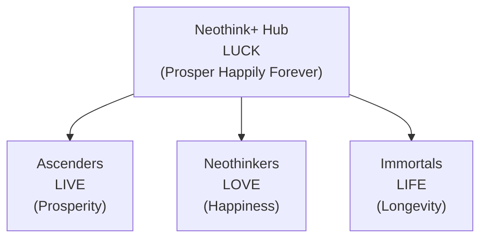
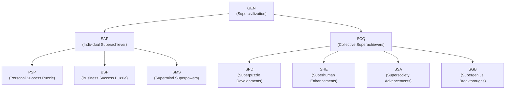

# Joshua Seymour — Architecting Positive-Sum Network States

> **Join the journey: [Neothink DAO](https://github.com/neothink-dao/neothink.io) for intrapreneurship and [Avolve DAO](https://github.com/avolve-dao/avolve.io) for entrepreneurship.**

> **Become a User or Admin in a new kind of society. Subscribe, participate, contribute—or build, fund, and help shape the future.**

Welcome! I’m Joshua Seymour.

I architect and steward digital-physical communities designed to unlock human flourishing—through positive-sum, regenerative, and network state principles. My focus is on building and evolving [Neothink DAO](https://github.com/neothink-dao/neothink.io) (intrapreneurship) and [Avolve DAO](https://github.com/avolve-dao/avolve.io) (entrepreneurship), each with a clear mission, founder, and path to progressive decentralization.

I thrive in global, collaborative environments—online and offline—and am always open to connecting, co-creating, and relocating for the right opportunities and teams.

- **Technical curiosity:** Experimenting with new models for coordination, learning, and value creation.
- **Philosophy:** Global meritocracy, open web values, and the power of decentralized, internet-native communities.
- **Vision:** Passionate about the “startup society” and network state journey, especially as it relates to solarpunk, regenerative futures.

Neothink DAO and Avolve DAO have already attracted early users and contributors. I’m always interested in new collaborators, partners, and aligned communities.

---

## Why Join?

- **User:** Become a Subscriber, Participant, or Contributor—enjoy access, community, and rewards in our apps and DAOs.
- **Admin:** Become a Venture Builder (building), Venture Partner (funding), or Venture Associate (helping)—shape new societies as a leader, backer, or supporter.

---

## At a Glance: The Ecosystem

| Project         | Focus                | For Whom?                      | Unique Value                              |
|-----------------|---------------------|--------------------------------|-------------------------------------------|
| [Neothink DAO](https://github.com/neothink-dao/neothink.io)    | Prosperity, Happiness, Longevity | Intrapreneurs, Visionaries    | Progressive journeys, unified rewards     |
| [Avolve DAO](https://github.com/avolve-dao/avolve.io)      | Regen Supercivilization         | Entrepreneurs, Builders, Teams | Degen→Regen journey, collective quests    |

---

## Your Journey

1. Choose your path: Ascender, Neothinker, Immortal, or Superachiever.
2. Become a User (Subscriber, Participant, Contributor) or Admin (Venture Builder, Partner, Associate).
3. Join the DAO(s) and unlock your personal and collective transformation.
4. Earn tokens, XP, and rewards as you progress.
5. Co-create a network state—digital, physical, and regenerative.

---

## Our Story & Why Now?

We’re at a tipping point: the world needs new models for prosperity, happiness, and longevity. By combining the best of digital and physical communities, we’re building network states that empower individuals and collectives to create lasting, positive-sum change. If you’re ready to help shape the future, you’re in the right place.

---

## Start Here

- [Neothink DAO (Intrapreneurship)](https://github.com/neothink-dao/neothink.io) — Build, scale, and innovate within an established vision.
- [Avolve DAO (Entrepreneurship)](https://github.com/avolve-dao/avolve.io) — Found, lead, and evolve a new regenerative ecosystem.
- [Connect with Joshua Seymour](https://www.joshuaseymour.com)
- **[Join our Community/Discord](#)** _(coming soon)_
- **Attend a Weekly Call:** Check each project’s repo for event details

---

## Governance & Network State Vision

Both Neothink DAO and Avolve DAO are parallel startup societies, intentionally structured to mature into true network states—each with a clear founder, a strong sense of mission, and a path toward progressive decentralization and self-governance.

> “A network state is a social network with a moral innovation, a sense of national consciousness, a recognized founder, a capacity for collective action, an in-person level of civility, an integrated cryptocurrency, a consensual government limited by a social smart contract, an archipelago of crowdfunded physical territories, a virtual capital, and an on-chain census that proves a large enough population, income, and real estate footprint to attain a measure of diplomatic recognition.”

**Founders & Governance Structure:**
- **Neothink DAO:**  
  - The recognized founder of Ascenders, Neothinkers, and Immortals (and their related values) is Mark Hamilton, his family, and their core supporters.
  - The Neothink+ monorepo is owned and controlled by Neothink DAO, with Mark Hamilton (along with his family and team) as the benevolent dictator and philosopher king, stewarding the project until these parallel societies mature to fully govern themselves.

- **Avolve DAO:**  
  - The recognized founder of Avolve and its super-projects is Joshua Seymour.
  - The Avolve repo is owned and controlled by Avolve DAO, with Joshua Seymour (along with his family and team) as the benevolent dictator and philosopher king, guiding the project until it matures into full self-governance.

**Stewardship Philosophy:**  
Both DAOs are committed to progressive decentralization. The “benevolent dictator” model is a temporary measure to ensure strong leadership, clear vision, and principled growth—until the communities are ready for fully decentralized, self-sustaining governance.

**Network State Trajectory:**  
Each society is intentionally structured to:
- Start as a focused, values-driven startup society
- Grow into a network union (digital community with collective action)
- Expand into a network archipelago (crowdfunded physical presence)
- Ultimately achieve the scale, legitimacy, and diplomatic recognition of a true network state

---

## 🚀 Neothink DAO (Intrapreneurship)

Neothink DAO unifies three archetypes—Ascender, Neothinker, and Immortal—each with a distinct journey and platform:

- **Ascender:** Access Ascension + FLOW + Ascenders. Build a profitable business, join a supportive community, and master the art of value creation. 
- **Neothinker:** Access Neothink + Mark Hamilton + Neothinkers. Unlock genius-level thinking, join the Neothink Fellowship, and master the knowledge economy.
- **Immortal:** Access Immortalis + Project Life + Immortals. Pursue longevity, health, and the ultimate goal of making death optional.

**Neothink+ Hub** helps you Prosper Happily Forever—synergizing your journey across all archetypes.

**Vision:**  
Prosper Happily Forever by becoming wealthier, healthier, and happier—through progressive journeys, weekly events, and a unified digital-physical experience.

| App           | Token | Theme        | Outcome                        |
|---------------|-------|--------------|--------------------------------|
| Ascenders     | LIVE  | Prosperity   | Build wealth & business mastery|
| Neothinkers   | LOVE  | Happiness    | Unlock genius & fulfillment    |
| Immortals     | LIFE  | Longevity    | Maximize health & lifespan     |
| Neothink+ Hub | LUCK  | Prosper Happily Forever | Synergy, cross-app rewards |

- **One Purpose:** Prosper Happily Forever  
- **Two Missions:** Individual & Collective  
- **Three Visions:** Prosperity, Happiness, Longevity  
- **Four Goals:** Ascender, Neothinker, Immortal, Superachiever

Each app is a progressive journey—beginner to advanced—where every action earns tokens, XP, badges, and unlocks new features.  
**Neothink+ Hub** unifies your experience, enabling synergy and rewards across all apps.

---

## 🌌 Avolve DAO (Entrepreneurship)

Avolve DAO is a platform for positive-sum transformation—helping individuals, collectives, and the ecosystem evolve from “Degen” (zero-sum, extractive) to “Regen” (positive-sum, regenerative).

**Three Core Values:**
- **Superachiever:** The individual journey of transformation (SAP token)
- **Superachievers:** The collective journey of co-creation (SCQ token)
- **Supercivilization:** The ecosystem journey for regenerative progress (GEN token)

**Storyline:**  
Most people are “Degens,” stuck in a zero-sum, follow-the-leader mentality that enables the Anticivilization. Avolve DAO empowers “Regens”—self-leaders, value creators, and integrated thinkers—to build a Supercivilization through personal and collective transformation.

**Game Loop:**  
- Create your Personal & Business Success Puzzle (SAP, PSP, BSP)
- Unlock Supermind Superpowers (SMS)
- Co-create the Superpuzzle (SPD, SHE, SSA, SGB)
- Accelerate the transition from Degen to Regen—for yourself and for the world

| Layer/Focus           | Token | Purpose/Outcome                                      |
|-----------------------|-------|-----------------------------------------------------|
| Supercivilization     | GEN   | Ecosystem transformation (Avolve from Degen to Regen)|
| Superachiever         | SAP   | Personal transformation (Success Puzzle)            |
| Superachievers        | SCQ   | Collective transformation (Superpuzzle)             |
| Personal Success      | PSP   | Health, Wealth, Peace                               |
| Business Success      | BSP   | Network, Admin, Profit                              |
| Supermind Superpowers | SMS   | Solve, Plan, Act                                    |
| Superpuzzle Devs      | SPD   | Grand collective progress                           |
| Superhuman Enhance.   | SHE   | Superhuman growth for all ages                      |
| Supersociety Adv.     | SSA   | Advance companies, communities, countries           |
| Supergenius Breakth.  | SGB   | Innovation and breakthroughs                        |

---

## 🗺️ Ecosystem Visuals

### Neothink DAO: LUCK Unifies LIVE, LOVE, LIFE

### Avolve DAO: GEN Unfolds the Supercivilization

---

## 🌐 Network State Vision

Neothink DAO and Avolve DAO are proto-network states: digitally native, values-driven communities with the potential to evolve into fully sovereign, self-governing entities.  
Each archetype and platform is a building block for a new kind of society—wealthiest, happiest, healthiest, and most regenerative—powered by flawless positive-sum game theory.

---

## 🏆 My Roles

- **Intrapreneur (Neothink DAO):**  
  - Architecting and scaling platforms within an established vision.
  - Driving innovation, onboarding, and internal growth.
- **Entrepreneur (Avolve DAO):**  
  - Founding, leading, and evolving a new regenerative ecosystem.
  - Building from scratch, driving adoption, and shaping governance.

---

## 📈 Roadmap & Next Steps

- Launching four interconnected apps with unified onboarding and gamified progression
- Immediate, actionable quests and rewards for new users
- Weekly live events for each archetype (Ascenders, Neothinkers, Immortals, Superachievers)
- DAO-governed treasury and positive-sum tokenomics
- Expanding the Supercivilization vision through Avolve DAO

---

## Frequently Asked Questions & Common Objections

**What is a “network state” and why should I care?**  
A network state is a digitally native community with a shared vision, real-world impact, and a path to self-governance. By joining early, you help shape the rules, culture, and benefits of a new society—while earning rewards and building meaningful relationships.

**Is this just another crypto project or online community?**  
No. While we use web3 and blockchain for transparency and coordination, our focus is on real transformation: personal, collective, and ecosystem-wide. Our DAOs are built around positive-sum values, not speculation.

**Do I need to be a developer or blockchain expert to join?**  
Not at all! Anyone can join as a Subscriber, Participant, or Contributor. We welcome learners, builders, creators, and supporters from all backgrounds.

**How do I actually get started?**  
Pick a path (Neothink DAO or Avolve DAO), join as a User or Admin, and follow the onboarding steps. Most communities have weekly calls, onboarding quests, and open channels for support.

**What if I just want to observe or learn before committing?**  
That’s fine! You can join our public calls, read our resources, or connect with members before diving deeper.

**What’s the business model? How are projects funded?**  
We use a mix of subscriptions, token rewards, and venture partnerships. Admins (builders, partners, associates) help shape and fund new projects, while Users enjoy access and community benefits.

**How do you avoid the pitfalls of other DAOs or online movements?**  
We focus on real-world value, progressive decentralization, and a clear governance roadmap. Our founders are public, our vision is long-term, and we prioritize collaboration over hype.

**How can I trust this isn’t a scam or rug pull?**  
Transparency is key: our founders are public, our code and governance are open, and our incentives are aligned for long-term growth and positive impact.

**What if I have more questions?**  
Reach out directly, join a call, or connect with us on social channels. We’re here to help!

---

> **Curious?**  
> Explore a platform. Join a call. Reach out directly.  
> The next chapter of networked transformation is just beginning.
